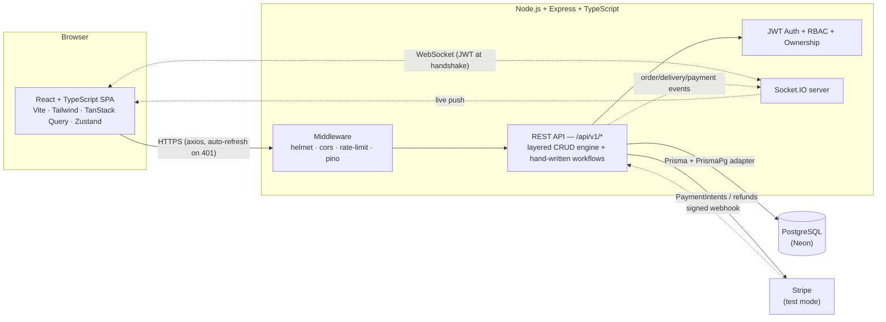
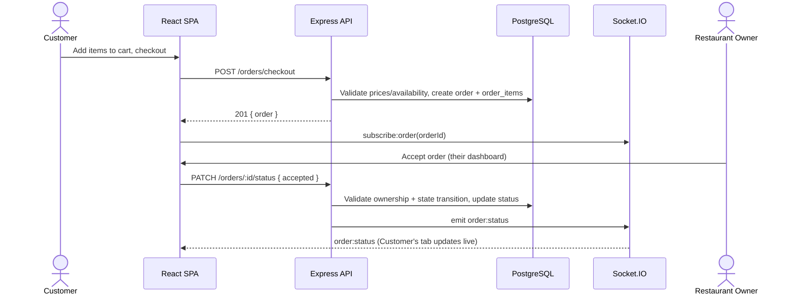

# BiteDash — Architecture Overview

## System diagram



## Request flow: placing and tracking an order



## Layers (backend)

```
routes (Express Router)
  -> controller   (parse request, validate with Zod, shape response)
    -> service    (business logic: pagination/filter/search, ownership, error mapping)
      -> repository (Prisma Client data access)
```

Twelve of the app's resources (customers, restaurants, menu items, orders, payments,
deliveries, reviews, etc.) run through one **generic, reusable implementation** of this
pipeline (`backend/src/core/`), configured per-resource (`backend/src/resources/*.ts`) rather
than hand-written per resource. Business logic that doesn't fit a generic CRUD shape — order
checkout, the order/delivery state machines, Stripe payment intents, real-time event
authorization — is deliberately **not** forced into that engine; it's hand-written in
`backend/src/orders/`, `backend/src/payments/`, and `backend/src/realtime/`, on the principle
that logic worth reading shouldn't be abstracted away.

## Why these specific technology choices

| Choice                                                                        | Why                                                                                                                                                                                         |
| ----------------------------------------------------------------------------- | ------------------------------------------------------------------------------------------------------------------------------------------------------------------------------------------- |
| **Prisma + `PrismaPg` driver adapter** (not the classic query engine)         | Queries go straight through `pg` over the driver-adapter protocol — no native Rust engine binary to match to the deployment OS/architecture, which matters for a portable Docker image.     |
| **Zod everywhere** (env vars, request bodies, resource create/update schemas) | One validation library for config _and_ API input — a single mental model, and Zod schemas double as the TypeScript types via `z.infer`.                                                    |
| **JWT access + rotating refresh tokens (hashed server-side)**                 | Stateless access tokens for speed, but refresh tokens are revocable (logout actually invalidates something) — a middle ground between pure-stateless JWT and full server-side sessions.     |
| **Socket.IO, not raw WebSockets**                                             | Automatic reconnection/fallback and room-based broadcast (`order:<id>`) out of the box — this app needed pub/sub semantics, not a bare socket.                                              |
| **TanStack Query, not a hand-rolled fetch+useEffect**                         | Server state (cache, refetch, invalidation-on-mutation) is a different problem from client state; Zustand handles the latter (auth session, cart) so each tool does one job.                |
| **Mocked-Prisma tests, no live test database**                                | Neon's pooled connection is too slow/unreliable for fast test iteration (documented pain point through Phases 1–3); mocking at the Prisma-client boundary also means CI needs zero secrets. |
