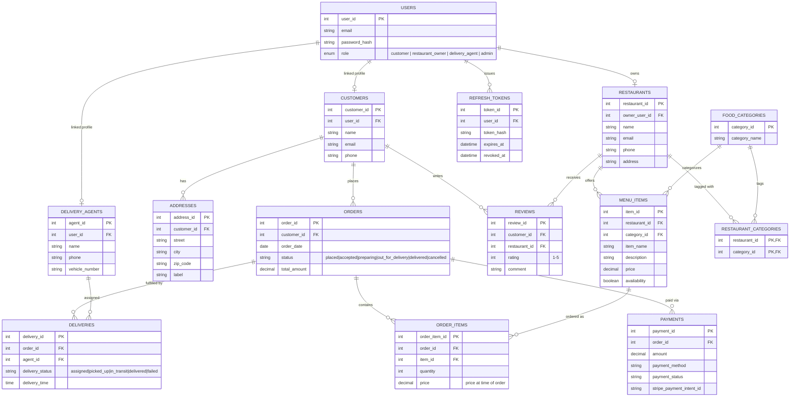

# BiteDash — Entity-Relationship Diagram

Generated from `backend/prisma/schema.prisma` (the source of truth — this file documents it,
it doesn't drive migrations). Twelve business tables plus two auth tables (`users`,
`refresh_tokens`) added in Phase 2, linked to the business tables via nullable foreign keys so
an auth identity is separate from — but connected to — its business profile.

## Notable design decisions

- **`restaurant_categories`** is a many-to-many junction table with a composite primary key
  (`restaurant_id`, `category_id`) — no surrogate key, since the pair itself is the identity.
- **`order_items.price`** is copied from `menu_items.price` at the time of the order, not
  looked up live — so a later menu price change never rewrites the price on a past order.
- **Auth is layered on top of, not merged into, the business schema.** `customers`,
  `restaurants`, and `delivery_agents` each existed before auth did (Phase 1); Phase 2 added
  `users`/`refresh_tokens` and a nullable one-to-one FK from each business table back to
  `users`, rather than folding email/password fields directly into those tables. This keeps
  "who can log in" cleanly separate from "who is a customer/restaurant/agent."
